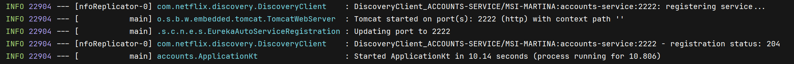
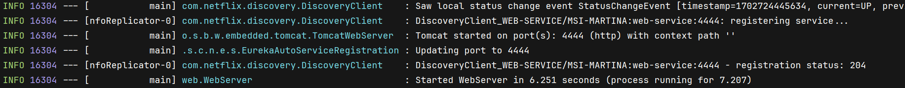
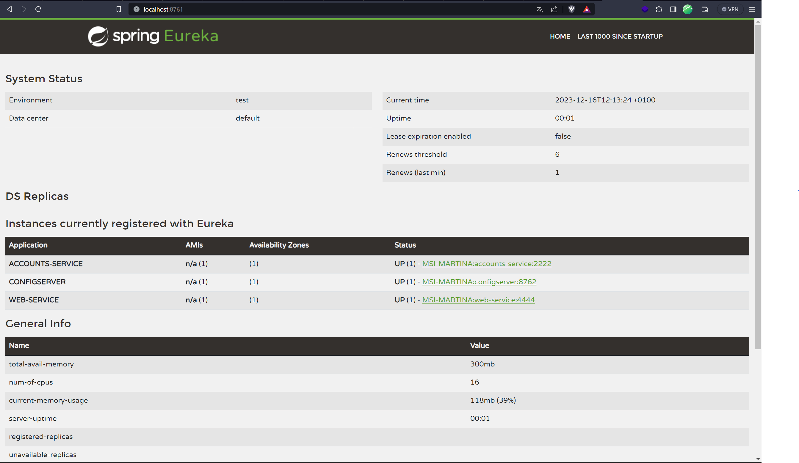
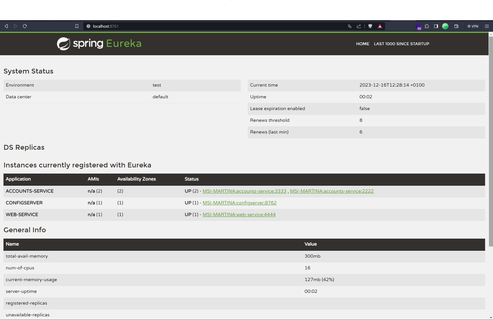
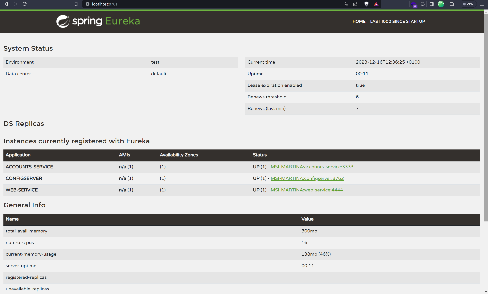
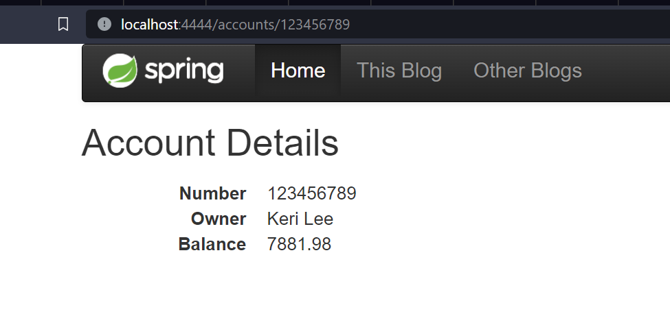
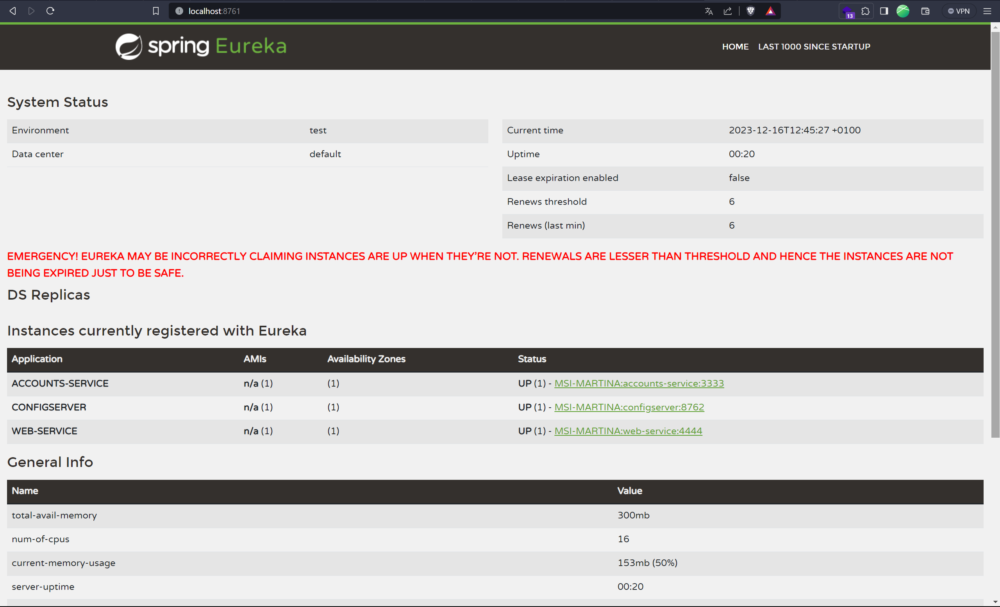
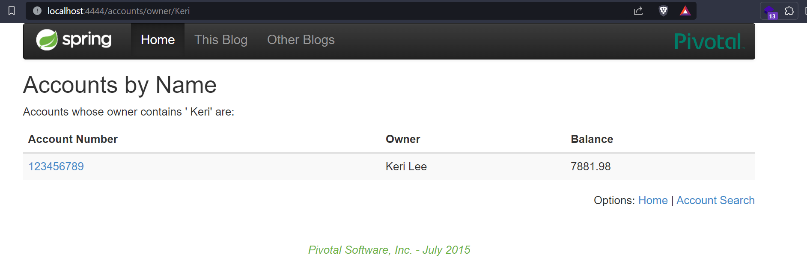
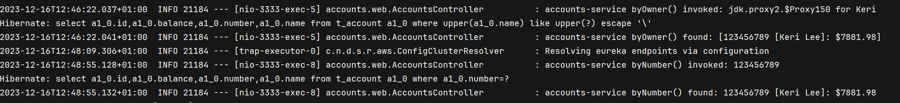

# LAB 6 - Microservices

## Task 1: Create and update the configuration
The new configuration is in https://github.com/MartinideLimon/lab6-microservices-config-repo

## Task 2: Two services accounts (2222) and web are running and registered (two terminals)
The accounts server is running on port 2222.

And the web server is running on port 4444.

## Task 3: The service registration service has these two services registered (a third terminal).
The following image shows the eureka dashboard where the two services are registered.

## Task 4: Update the configuration repository so that the accounts service uses now the port 3333.
The accounts service is running now on port 3333.
The link to the commit is
https://github.com/MartinideLimon/lab6-microservices-config-repo/commit/bcbad3d7ebf4e06dbd9aba93c947adc11f36bbb9

## Task 5: Run a second instance of the accounts service using the new configuration (a fourth terminals). 
### What happens? 

Now we can see that are two different instances of account server, that is because we had run a second instance 
with the new configuration of the port and eureka registers it again.

## Task 6: What happens when you kill the service accounts (2222) and do requests to web?. 
In the next image we can see that there is only one instance of the accounts server running.

And if we do a request to the web, it works.

## Task 7: Can the web service provide information about the accounts again?. Why? 
Yes, because there was two instances of the accounts server and when we stop one, 
the other is still running in a different port, and due to that the requests works.

